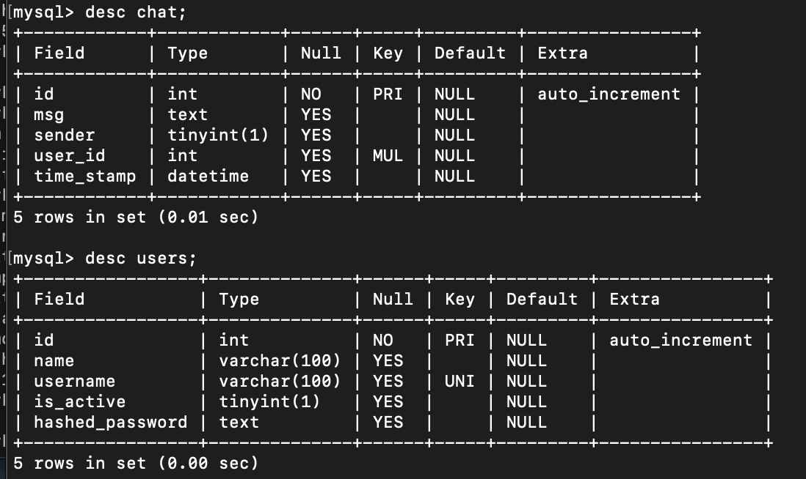

## Add secret key in main.py

to create secret key run= `openssl rand -hex 32` in your terminal.

## Change database url in database.py

## Run

`uvicorn main:app --reload`

Rochak's service at get_responce_RAG() in main.py

## In code
database-> db_example
tables -> chat, users

